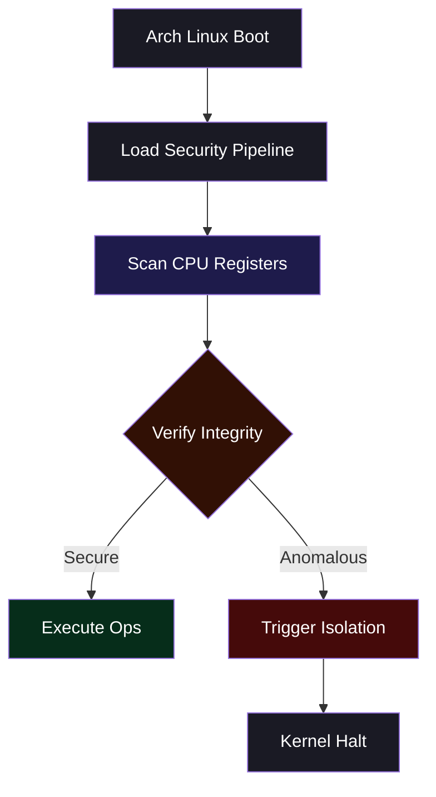

# Boutaba Motezeballah
### Systems Architect & Reverse Engineer

```assembly
; Arch Linux Microarchitectural Initialization Profile
section .text
    global _start

_start:
    mov rax, 60         ; sys_exit syscall
    xor rdi, rdi        ; status 0
    syscall
```

## Professional Summary
Academic systems engineer specializing in low-level Arch Linux security, hardware memory protection, and assembly-level binary analysis.

---

## Architecture Operational Flow



---

## Technical Inventory
- **Languages:** Assembly (x86_64), C/C++20, Python
- **Environment:** Arch Linux, Systemd
- **Analysis:** IDA Pro, Ghidra, GDB
